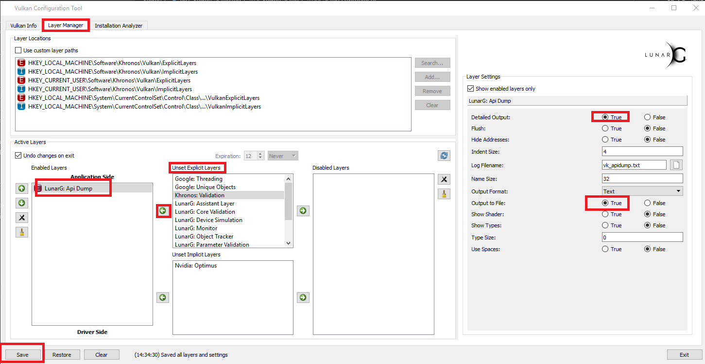

# Vulkan Setup

- [x] 怎么确定 ICD 支持 vulkan，怎么去更新 ICD , 这个就是硬件驱动
- [ ] 我的 Configurator tool 打开 看不到要监听的类型了。
  
## Setup Environment

* 在[官网](https://vulkan.lunarg.com/)下载SDK 并安装  
* 打开 **%%InstallPath%%Documentation/index.html** 文档目录，看文档  
* 在文档 **System Requirements** 项里面，有说明，需要安装的软件，我安装了**vs2017,cmake3.12.2,python 3.5.1**  
* 由于我的确不知道怎么确认 ICD，以及安装ICD，文档里面说是去找显卡供应商要驱动。这样我就只能假定我已经安装好了。  
* 然后先验证SDK是否能运行，运行via来看是否能正常，在 **Start Menu->Vulkan SDK \<version\>->VIA** ，如果能正常运行，会有一个旋转的cube出现。
* 编译Demo，直接打开 **%InstallPath%/Demos/DEMOS.sln** 工程，并编译，里面有些demo的源代码，编译运行，如果一切征程，也是有一个旋转的cube。
* 编译 Sample Code，这个文档里面也有说明，文档在 **vulkan_samples.html** 首先确定cmake,python是否都安装正确。然后通过vs2017的开发者环境启动cmd.  
在 **Start Menu-> Visual Studio 2017-> Developer Command Prompt for VS 2017** 调用命令  
```
cd /d %InstallPath%/Samples  
set PATH=%PATH%cmakepath;pythonpath;
call build_windows_samples.bat
```
这样就会自动生成vs的工程并且会编译出来exe来，稍等一下，编译的结果在 **%InstallPath%/Samples/Build/API-Samples/Debug**  
我遇到的问题:开始没有把cmake设置到PATH里面，没有python3，没有使用Developer Command Prompt for VS ，就导致批处理找不到msbuild,cmake,python这些命令。当这些一切都准备好的时候，就可以正确编译了。  
* 开启验证和辅助功能，(Enable Validation and Utility Layers),这个监控功能可以让开发者有能力在不修改程序的情况下，监控程序的一些信息，例如，dumping API entry point，或则截屏等。  
  这个在文档也有详细的介绍，首先打开 **Start Menu->vulkan->Vulkan Configurator**,这是一个应用程序，他会先运行一个旋转的cube，之后就会打开界面，然后再上面的tab页上，切换到Layer Manager，然后在界面的中间 **Unset Explicit Layers** 中找到 **LunarG: Api Dump**，把他移动到左边，表示要打开这个监听功能，再右边的属性里面，勾选上细节输出和输出到文件。然后点击保存。
  然后我们再运行vkcube程序，就是那个旋转的cube，就会发现在他的目录下生成了 vk_apidump.txt 文件了。设置如图：  
    
  
* 经过这些，我觉得vulkan的初始相关的东西就差不多了，文档里面还有更多的东西，例如创建vulkan的工程等。
* 文档里面还有很多vulkan的东西，例如他的架构，工具，等等，都需要认真看一下。

## troubleshooting

### Configurator tool 打开是空的
这个目前还不知道怎么解决。