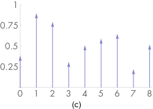

# 7.1 采样原理

 When thinking about digital images, it is important to differentiate between image pixels, which represent the value of a function at a particular sample location, and display pixels, which are physical objects that emit light with some distribution. (For example, in an LCD display, the color and brightness may change substantially when the display is viewed at oblique angles.) Displays use the image pixel values to construct a new image function over the display surface. This function is defined at all points on the display, not just the infinitesimal points of the digital image’s pixels. This process of taking a collection of sample values and converting them back to a continuous function is called reconstruction.

&#160;&#160;&#160;&#160;
数字图像(digital image)通常表示为一组矩形网格的像素值。当数字图像显示在物理设备上时，这些值用于确定显示器对应像素发射的光谱功率。当我们考虑数字图像，要注意和图像像素的区分(image pixels)，显示像素(display pixels)。图像像素是一个位置土工特定采样函数得到的值。显示像素物体发射光的分布。
 When thinking about digital images, it is important to differentiate between image pixels, which represent the value of a function at a particular sample location, and display pixels, which are physical objects that emit light with some distribution. (For example, in an LCD display, the color and brightness may change substantially when the display is viewed at oblique angles.) Displays use the image pixel values to construct a new image function over the display surface. This function is defined at all points on the display, not just the infinitesimal points of the digital image’s pixels. This process of taking a collection of sample values and converting them back to a continuous function is called reconstruction.

数字图像表示为一组像素值，通常在矩形网格上对齐。当数字图像显示在物理设备上时，这些值用于确定显示器上像素发射的光谱功率。在考虑数字图像时，重要的是要区分图像像素（代表特定采样位置上函数的值）和显示像素（显示像素），这些像素是发射具有一定分布的光的物理对象。（例如，在LCD显示器中，当以倾斜角度查看显示器时，颜色和亮度可能发生重大变化。）显示器使用图像像素值在显示表面上构建新的图像功能。这个函数定义在显示器上的所有点上，而不仅仅是数字图像像素的极小点。这种获取样本值并将其转换回连续函数的过程称为重构。

d$c^2$
