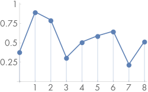

# 7.1 采样原理

&#160;&#160;&#160;&#160;
数字图像(digital image)通常表示为一组矩形网格的像素值。当数字图像显示在物理显示设备上时，显示设备会使用这些像素值来呈现显示效果。对于数字图像，图像像素(image pixels) 和 显示像素(display pixels)的区分。图像像素是一个位置土工特定采样函数得到的值。显示像素则为物体发射的光谱分布（例如，在LCD显示器上发射的像素为显示像素，他是一个新的光谱，我们从不同的角度看同一个点会得到不同的颜色和亮度值）。显示器使用图像像素值作为输入，然后重新计算出和原来图像近似的效果并呈现在屏幕上的过程我们叫做重建(reconstruction)。  
我们有个概念，现实世界中，投影到现实平面上的颜辐射率是连续的，例如物体反射光到眼睛的辐射率是连续的，物体反射光到照相机的镜头里面的辐射率是连续的。我们通过一系列方法，把这些连续的图像变换成离散的数字图像保存起来。这个过程我们叫做采样。然后我们保存的数字图像通过显示器显示出来，显示器整个显示平面所有点都会发射光谱，而不是简单的使用离散数据，显示器将这些离散数据经过一系列变化转换了连续的光谱函数。这个过程叫做重建。

&#160;&#160;&#160;&#160;
为了计算出离散的像素值，我们需要对原来的连续函数进行采样，在PBRT中，和其他的光线追踪渲染器一样，通过追踪光线去得到采样数据。例如，在胶片平面上两个点之间的图像变化函数，我们找不到一个通用的方法可以去表示他。虽然我们可以通过去胶片上的每个像素点精确采样也能生成和他近似的数字图像。但是如果通过更多的采样点和一定的附加信息结合，可以生成质量更好的数字图像。实际上，为了得到更好的结果，然后显示设备能尽可能呈现出和原来一样的图像，虽然他们之间有一些差别，本章的目标就是处理这些差别。  
因为采用和重建得到的是原来图像的近似结果，这种近似的结果会导致走样。重建的图像发现边缘有锯齿或动画有闪烁都是走样的典型表现。这种错误的原因是采样不能覆盖到连续图像的所有信息。
&#160;&#160;&#160;&#160;
我们对这些概念做个举个例子，看图7.1  
  
其中图a表示了一个1维(1D)的连续函数 $f(x)$ , 他上面的点是通过采样算法的数据点，图b表示了使用采样数据重建的结果函数$\tilde{f}(x)$ ，
还没有写完。。。todotodo

