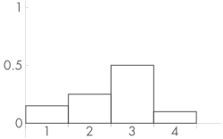
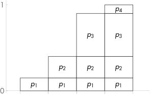

# 13.3 采样随机数

## 13.3.1 反演方法

&#160;&#160;&#160;&#160;
反演算法，是指用一个或多个单位随机数(uniform random variables), 把他们映射到需要的随机分布中。接下来会用一个简单的例子来解释这个过程。假如我们有4个随机值(prossible outcomes),他们的概率(propabilities)分别是$p_1$,$p_2$,$p_3$,$p_4$。而其他他们的概率和为1($\sum_{i=1}^{4}p_{i} = 1$ )。如图13.1所示

&#160;&#160;&#160;&#160;
图13.1,展示了一个离散的概率密度函数(PDF, probabilities density fucntion)。X的轴方向上，白色方块的宽度表示样本的随机值。它只能是1,2,3,4四个。Y周方向上，白色方块的高度表示他的概率。它的概率大于0，而且这四个随机值的概率之和等于1。

&#160;&#160;&#160;&#160;
为了从这个示例随机数中提取样本，我们先找到他的CDF(概率累加函数，cumulative distrubution function)函数$P(x)$, 它就是 PDF$(p(x))$的积分，对于这个示例来说，我们可以直接把对应的概率叠加起来就是它的CDF$P(x)$，效果如图13.2  
  
&#160;&#160;&#160;&#160;
图13.2:其中x轴方向表示这个函数取值，他也只能取1,2,3,4。y轴方向方块的高表示取小于等于这个值的概率和($\sum_{i=0}^{x}p(i)$)。注意最高4的值是1，因为他们总的概率和为1($\sum_{i=0}^{4}p(i) = 1$)。  
&#160;&#160;&#160;&#160;
去抽样这个分布，我们使用一个标准随机数(canonical uniform random variable)$\xi$去对应这个分布的随机概率，我们发现，$xi$在Y轴方向的值就等同于他CDF的值，参考图13.3  
  
&#160;&#160;&#160;&#160;
这里要啰嗦一下，标准随机数$\xi$,他是一个[0,1)的实数范围内，每个数值的概率都是一样的，而且他们的概率和为1。所以他的CDF就等于他们的值。图13.3中，我们看他他最后一列，就是所有随机值都在的那一列，他们的和也是1，而且我们刚好可以和标准随机数对应上来。 [0-0.15)表示p1的概率，[0.15-0.40)表示p2的概率,[0.40-0.90)表示p3的概率.[0.90-1.0)表示p4的概率。这样我们就可以通过对单位随机数抽样，来逆推回原来的样本的采样结果。例如对单位随机数抽样结果为0.3,0.5,0.6,0.95,就对应了原来随机数的，p2,p3,p3,p4。这个就是反演方法。  
&#160;&#160;&#160;&#160;
同样，对于连续随机函数PDF$p(x)$来说，我们计算他的CDF$P(x) = \int{p(x)}$,对于采样值$x_i$来说，他的概率是$p(x_i)$,他的CDF是$\int_{0}^{x_i}p(x)dx$,由于他们的概率总和为1($\int_{0}^{1}p(x)dx = 1$)，所以这个也可以映射到标准随机数上，我们也可以在标准随机数里面抽样，然后通过反演函数$p^{-1}(\xi)$,反向计算出他对应的采样值$x_i$。可以把过程总结为以下几步:  

1. 我们已知PDF$p_{xi} = p(xi)$。
2. 通过PDF，我们可以计算出CDF，$P_{xi} = P(xi) = \int_{0}^{xi}{p(x)dx}$
3. 已知可以将CDF和$\xi$的对应起来：$P(\xi) = \int_{0}^{xi}{p(x)dx}$。
4. 我们对$\xi$采样得到样本值$v$。这个样本值就对应原来分布的CDF值$v = \int_{0}^{xi}{p(x)dx}$
5. 然后把这个样本值反向($P^{-1}(\xi)$)计算回去，得到原来分布的样本值$xi$。

这个过程就叫做反演方法，这里再啰嗦一下，为什么原分布的CDF，可以通过单位随机数来对等?  
通过13.3等可以直观的看出来，他们的的Y轴范围都是[0,1)，对每一个单位随机数的值，都能对应上原分布的CDF的值，所以他们是可以映射上的。我们可以假定抽取了单位随机数的值，就是对应原函数CDF对应的值，那么我们只要对CDF做逆变换求出x就可以了。相当于我们以前的公式：  
$y = f(x) ==> x = f^{-1}(y)$,我们现在有了y值，所以需要逆推求出x值，这个就是反演方法了。

### 指数分布示例

